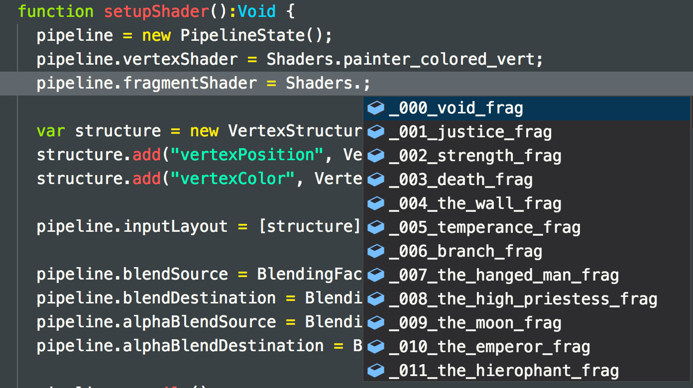

# PIXEL SPIRIT ELEMENTS

kha/haxe playground of the fantastic [pixel spirit elements deck](http://pixelspiritdeck.com) from [patricio gonzalez vivo](http://patriciogonzalezvivo.com/)

original code is [here](https://github.com/patriciogonzalezvivo/PixelSpiritDeck)

personally, i bought the pixel spirit elements deck. which as a visual & learning platform is fantastic.
if you get the chance, purchase a deck & support the artist.

# HOW TO USE IT

you need [kode studio](https://github.com/Kode/KodeStudio/releases) & simply drag & drop the project folder into it & run a the project. you can use visual studio code if you so wish, but thats a bit more of a work around to get up & running with kha.

to change the shader, go to the `setupShader()` function & find where the fragment shader is set in the pipeline.

there are 48 shaders to look at & play with & 1 extra file which has many different commands, collected up so you can use them in other projects.

[lewis lepton](https://lewislepton.com)

extra things to add. 
• add in ui support to flick thru each card without having to close, rename & restart project